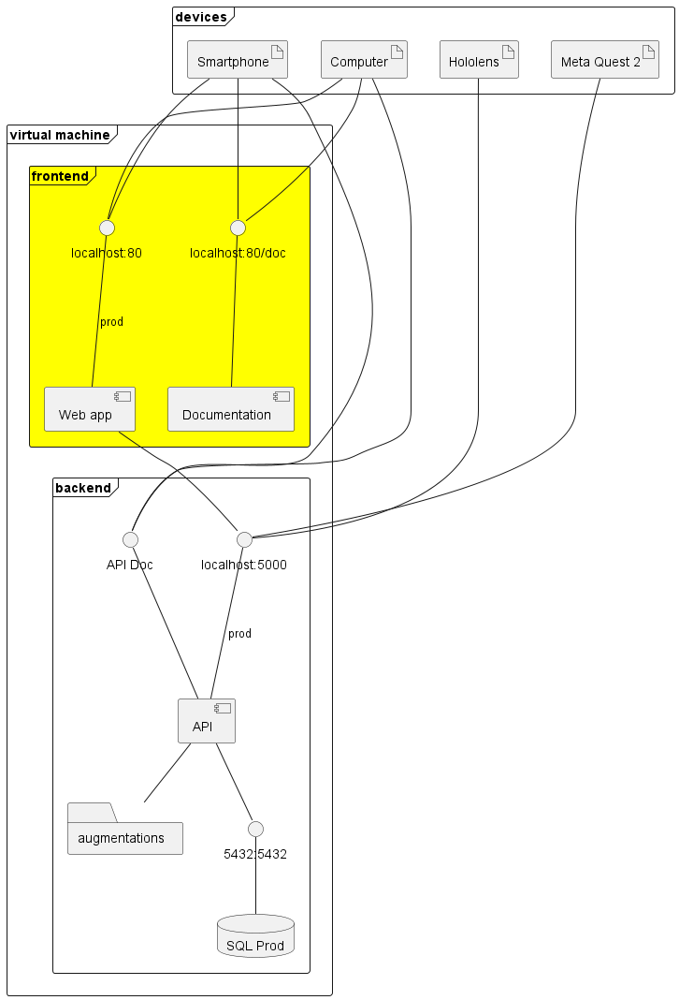
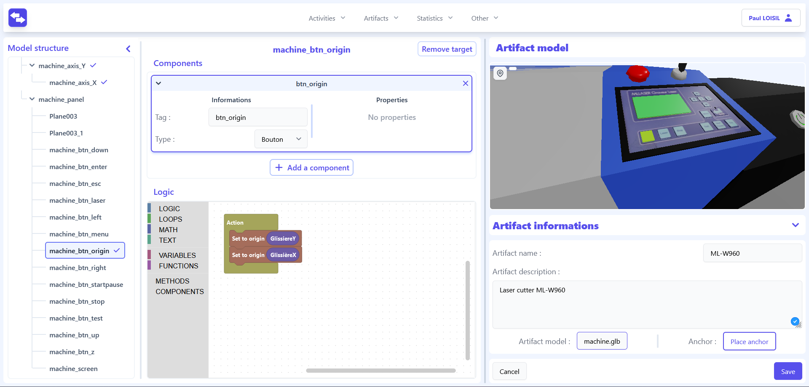

<h2 align="center">HELP - Web</h2>
<h3 align="center">Hybrid Extended Learning Platform - Web platform</h3>
<p align="center">
    <a href=""></a>
    <a href=""></a>
    <a href=""></a>
</p>

## Description
Hybrid Extended Learning Platform is a software package that aims to ease the creation of XR content for intructional usage. The principle is to use a unique web interface to design instructional activities with augmentations and access it throught AR ou VR client. 

## Component Description
This repository contains the source code for the web interface of the authoring tool and its documentation. It is part of the HELP porject. To properly work, it requires also the [HELP API](https://github.com/ERPI-UL/HELP-API) (the URL to the the API has to be define through the variable `VITE_API_URL`).



This interface allow the creation of environments, the creation of activites, and the importation of model. It is also through the web app that learners can connect to its account on a client (XR headset). 



## Instruction
This component use Docker to ease the deployment.
### Development mode

```sh
docker compose -f docker-compose.dev.yml up -d
```
### Production mode
```sh
docker compose -f docker-compose.prod.yml up -d
```

## Ackowledgment
The development of the tool that initiated this work was funded by the Grand Est region.