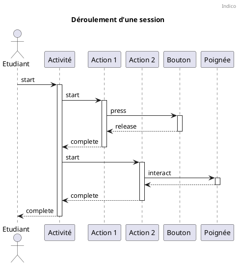

# Performance
Les routes performance de l'API permettent de récupérer des données lorsqu'un utilisateur lance une activité dans un des appareils XR.

!!! warning
    Performance API est un sous-ensemble / inspiration de [xAPI](https://xapi.com/).
    Pour le moment Indico ne possède pas de LRS pouvant passez les tests de conformité xAPI.

Voici la liste des verbes utilisés dans l'API Performance :

| Verbe | Description |
| --- | --- |
| `complete` | Indique que l'acteur a terminé l'objet. |
| `start` | Indique que l'acteur a commencé l'objet. Par exemple, lorsque quelqu'un démarre un cours, un module de cours ou un test. |
| `interact` | Indique que l'acteur a interagi avec l'objet. Par exemple, quand une personne touche un composant sur un artefact. |
| `launch` | Indique que l'acteur a lancé l'objet. Par exemple, lorsque quelqu'un lance une activité |
| `help` | Indique que l'acteur a demandé de l'aide concernant l'objet. Par exemple, quand une personne demande de l'aide sur un cours, un module de cours ou un test. |
| `press` | Indique que l'acteur a appuyé sur l'objet. Par exemple, quand une personne appuie sur un bouton sur un artefact. |
| `release` | Indique que l'acteur a relâché l'objet. Par exemple, quand une personne relâche un bouton sur un artefact. |
| `pause` | Indique que l'acteur a mis en pause l'objet. Par exemple, quand une personne met en pause un cours |
| `skip` | Indique que l'acteur a sauté l'objet. Par exemple, quand une personne saute une action sur une activité. |
| `view` | Indique que l'acteur a vu l'objet. Par exemple, quand une personne regarde une machine. |

