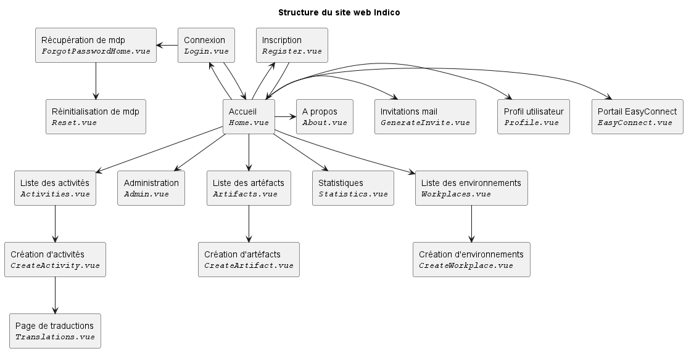
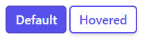
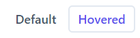
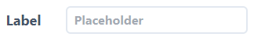
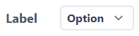
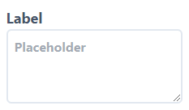
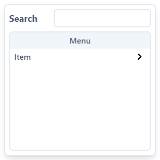

# Informations
## Technologies utilisées
Le site web est développé en utilisant trois langages principaux :

- [HTML](https://developer.mozilla.org/fr/docs/Web/HTML)
- [CSS](https://developer.mozilla.org/fr/docs/Web/CSS)
- [JavaScript](https://developer.mozilla.org/fr/docs/Web/JavaScript)

Ainsi que deux frameworks :

- [Vue.js](https://vuejs.org/)
- [Tailwind CSS](https://tailwindcss.com/)

## Structure et fichiers du site web
### Pages
Le site web est composé de plusieurs pages, qui sont toutes des composants Vue.js situés dans le dossier `src/views`.
pour vous représenter la structure du site web, voici un diagramme représentant les pages et leurs relations :

### Composants
Le site contient aussi plusieurs composants Vue.js pour ses interfaces, situés dans le dossier `src/components`.

Les composants sous forme de cartes sont regroupés sous le dossier `src/components/cards`,
idem pour les composants d'entrées de formulaire qui sont regroupés sous le dossier `src/components/inputs`.

Il existe plusieurs types d'entrées, en voici une liste :

| Nom           | Description                  | Fichier            | Visuel                              |
| ------------- | ---------------------------- | ------------------ | ----------------------------------- |
| Block Button  | Bouton au fond coloré        | `ButtonBlock.vue`  | {:style=max-height:38px}   |
| Text Button   | Bouton au fond transparent   | `ButtonText.vue`   | {:style=max-height:38px}     |
| Text Input    | Champ texte classique        | `InputText.vue`    | {:style=max-height:38px}       |
| Choice Input  | Selecteur de valeurs         | `InputChoice.vue`  | {:style=max-height:38px}   |
| Text Area     | Zone de texte                | `InputArea.vue`     | {:style=max-height:90px}         |
| Menu selector | Menu de selection d'éléments | `MenuSelector.vue` | {:style=max-height:160px} |