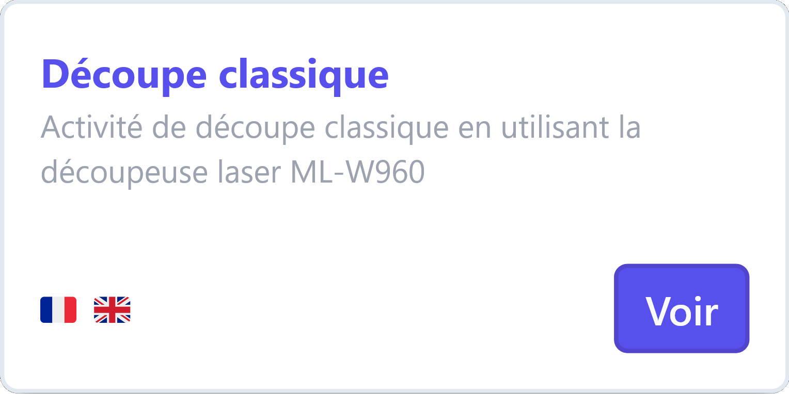
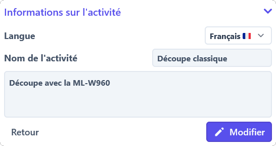
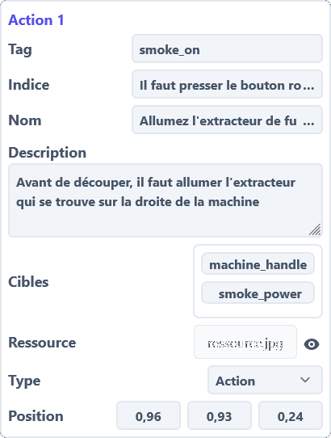

# Consulter les activités
De nombreuses activités très différentes sont disponibles sur Indico, et il est parfois difficile de s'y retrouver.
Cette page vous permettra de comprendre ce qu'est une activité.

## Qu'est-ce qu'une activité ?
Si vous n'avez aucune idée de ce qu'est une activité,
nous vous invitons tout d'abord à regarder le [lexique](../../lexicon.md) d'Indico pour intégrer les termes de base.

## Où trouver les activités ?
Les activités sont accessibles depuis n'importe quelle page web d'Indico.

Si vous êtes sur la page d'accueil du site web,
vous pouvez cliquer sur le bouton `Activités` dans la barre de navigation en haut de la page.

Si vous êtes sur une autre page que la page d'accueil,
dépliez en premier temps le menu de navigation en cliquant sur les trois barres en haut à droite.
Une fois le menu déplié, cliquez sur le bouton `Activités` du menu.

Une liste des activités vous sera alors proposée, chaque tuile correspondant à une activité différente.
Ces tuiles contiennent les informations de base d'une activité, comme:

<section markdown="1" style="display: flex; justify-content: space-between; align-items: center; flex-wrap: wrap;">

- Le titre de l'activité
- La description de l'activité
- Les langues de l'activité

{:style=width:300px;}

</section>

## Comment lire une activité ?
Beaucoup d'informations différentes sont affichés sur la page d'une activité.
Si vous vous sentez submergé par toutes ces informations, c'est normal.

Nous allons vous expliquer comment lire une activité, et vous montrer comment retrouver les informations qui vous intéressent.

### Informations générales
Comme pour toutes les autres ressources du projet Indico,
les informations générales d'une activité sont affichées en bas a droite de la page.

C'est à cet endroit que vous retrouverez les informations de base de l'activité, comme:

<section markdown="1" style="display: flex; justify-content: space-between; align-items: center; flex-wrap: wrap;">

- Les langues de l'activité
- Le titre de l'activité
- La description de l'activité
- Un bouton de retour à la liste des activités
- Un bouton de modification de l'activité

{:style=width:300px;}

</section>

### Prévisualisation de l'activité
Sur la version pour ordinateur de la page d'une activité,
vous pouvez voir une prévisualisation de l'activité en haut à droite de la page.

Cette prévisualisation vous permet de voir le ou les artéfacts de l'activité,
ainsi que l'évolution de l'activité en fonction des actions que vous regardez.

### Actions de l'activité
La partie la plus importante de la page d'une activité est la liste des actions de l'activité.

Ces actions sont affichés à gauche de la page, et représentent les différentes étapes de l'activité.

Pour chaque action, vous pouvez voir:

<section markdown="1" style="display: flex; justify-content: space-between; align-items: center; flex-wrap: wrap;">

- L'étiquette de l'action
- Le nom de l'action
- La description de l'action
- L'indice de l'action
- Les cibles de l'action
- Les ressources de l'action
- Le type de l'action
- La position de l'action dans l'activité

{:style=width:300px;}

</section>

Les actions d'une activité se suivent dans l'ordre de leur position dans l'activité,
de haut en bas.

### Jouer l'activité
Un bouton "Exécuter l'activité" se trouve en bas de la page.
Il vous permet de jouer l'activité, c'est à dire de la lancer et de la suivre de manière à comprendre son déroulement et imaginer ce que les étudiants verront.