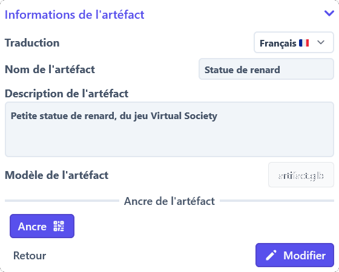
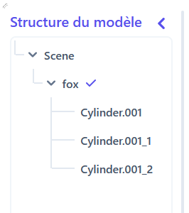
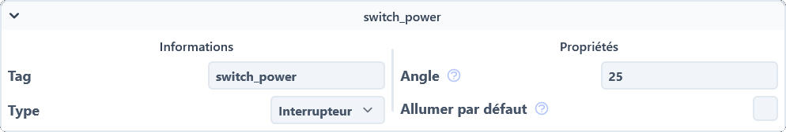

# Consulter les artéfacts
De nombreux artéfacts très différentes sont disponibles sur HelpXR, et il est parfois difficile de s'y retrouver.
Cette page vous permettra de comprendre ce qu'est un artéfact.

## Qu'est-ce qu'un artéfact ?
Si vous n'avez aucune idée de ce qu'est un artéfact,
nous vous invitons tout d'abord à regarder le [lexique](../../lexicon.md) de HelpXR pour intégrer les termes de base.

## Où trouver les artéfacts ?
Les artéfacts sont accessibles depuis n'importe quelle page web de HelpXR.

Si vous êtes sur la page d'accueil du site web,
vous pouvez cliquer sur le bouton `Artéfacts` dans la barre de navigation en haut de la page.

Si vous êtes sur une autre page que la page d'accueil,
dépliez en premier temps le menu de navigation en cliquant sur les trois barres en haut à droite.
Une fois le menu déplié, cliquez sur le bouton `Artéfacts` du menu.

Une liste des activités vous sera alors proposée, chaque tuile correspondant à un artéfact différent.
Ces tuiles contiennent les informations de base d'un artéfact, comme:

<section markdown="1" style="display: flex; justify-content: space-between; align-items: center; flex-wrap: wrap;">

- Le titre de l'artéfact
- La description de l'artéfact
- Les langues de l'artéfact

{:style=width:300px;}

</section>

## Comment lire un artéfact ?
Beaucoup d'informations différentes sont affichés sur la page d'un artéfact.
Si vous vous sentez submergé par toutes ces informations, c'est normal.

Nous allons vous expliquer comment lire un artéfact, et vous montrer comment retrouver les informations qui vous intéressent.

### Informations générales
Comme pour toutes les autres ressources du projet HelpXR,
les informations générales d'un artéfact sont affichées en bas a droite de la page.

C'est à cet endroit que vous retrouverez les informations de base de l'artéfact, comme:

<section markdown="1" style="display: flex; justify-content: space-between; align-items: center; flex-wrap: wrap;">

- Les langues de l'artéfact
- Le titre de l'artéfact
- La description de l'artéfact
- Un bouton de retour à la liste des artéfacts
- Un bouton de modification de l'artéfacts (si autorisé)

{:style=width:300px;}

</section>

### Prévisualisation de l'artéfact
Sur la version pour ordinateur de la page d'un artéfact,
vous pouvez voir une prévisualisation de l'artéfact en haut à droite de la page.

Cette prévisualisation vous permet de voir le modèle 3D de l'artéfact,
ainsi que la position des différentes parties de l'artéfact une fois sélectionnées.

### Structure de l'artéfact
<section markdown="1" style="display: flex; justify-content: space-between; align-items: center; flex-wrap: wrap;">

Une vue globale de la structure de l'artéfact est affichée à gauche de la page.

Cette vue permet de voir les différentes parties de l'artéfact,
ainsi que les sélectionner pour voir leurs éventuels composants.

Pour chaque partie de l'objet, une petite coche est affichée à droite de son nom
pour indiquer si la partie est une cible de l'artéfact ou non.

{:style=width:250px;}
</section>

### Composants d'une partie
Lorsque vous sélectionnez une partie de l'artéfact,
les composants de cette partie sont affichés au centre supérieur de la page.

Les composants sont affichés sous forme de tuiles,
et contiennent les informations de base d'un composant, comme:

- L'étiquette unique du composant
- Le type de composant
- Les propriétés du composant

{:style=height:100px;}

### Logique d'un composant
Si vous sélectionnez un composant,
la logique de ce composant s'affichera au centre inférieur de la page.

La logique de ce composant est affiché sous forme de blocs de code,
et représente le code qui sera exécuté lors des différents évènements du composant.

Pour plus d'informations, nous vous invitons à consulter la page développeur sur [Blockly](../../developer/website/blockly.md).